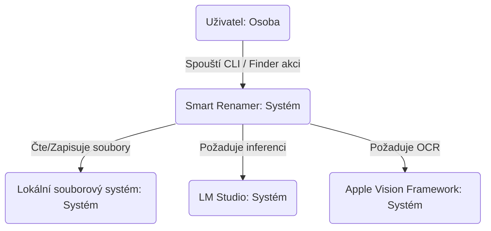
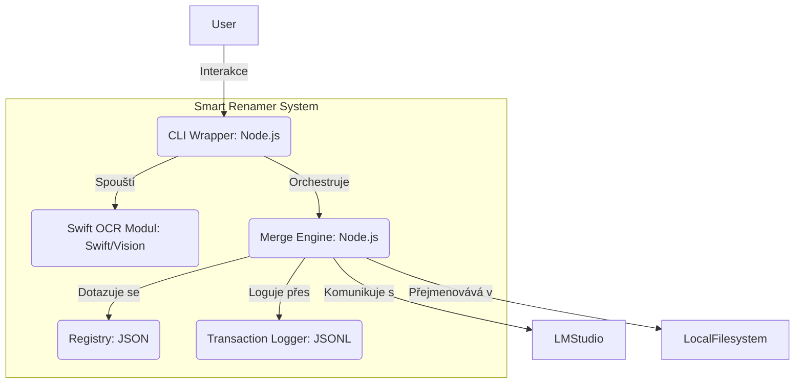
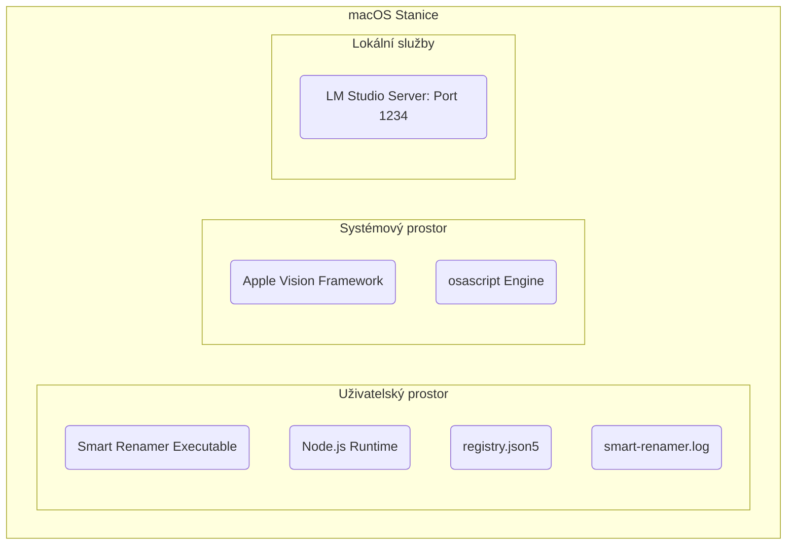

# OBCHODNÍ POSTOJ

Nástroj Smart Renamer řeší neefektivitu a nekonzistenci při ruční archivaci
dokumentů. Pro jednotlivce a malé firmy, které zpracovávají velké objemy
digitálních dokumentů (faktury, smlouvy, účtenky), představuje čas strávený
vymýšlením názvů značnou režii. Hlavními obchodními cíli jsou zvýšení
produktivity pomocí automatizace, zajištění vysoké prohledávatelnosti archivu a
zachování absolutního soukromí dat.

Obchodní priority:

1. Soukromí dat: Zajištění, aby citlivé finanční a osobní dokumenty nikdy nebyly
   odeslány do cloudových služeb.
2. Přesnost: Zamezení halucinacím v názvech souborů, které by mohly vést k
   chybnému zařazení dokumentů.
3. Efektivita: Minimalizace času mezi pořízením dokumentu a jeho strukturovaným
   uložením.
4. Intencionální minimalismus: Udržování jednotné konvence pojmenování pro
   snížení kognitivní zátěže při vyhledávání.

Hlavní obchodní rizika:

1. Únik dat: Náhodný přenos obsahu dokumentů externím poskytovatelům LLM, pokud
   by došlo k obejití lokálního omezení.
2. Integrita/ztráta dat: Chyby v logice přejmenování, které by mohly přepsat
   důležité soubory nebo vytvořit nekonzistentní strukturu.
3. Provozní selhání: Závislost na specifickém lokálním prostředí (LM Studio,
   Apple Vision), které se může měnit s aktualizacemi OS.
4. Riziko nepřesnosti: Chybná extrakce dat nebo názvů firem vedoucí k
   neuspořádanému archivu vyžadujícímu ruční opravu.

# BEZPEČNOSTNÍ POSTOJ

Existující bezpečnostní opatření:

1. security control: Validace Localhost. Systém striktně kontroluje, zda
   LM_STUDIO_URL směřuje na 127.0.0.1 nebo localhost.
2. security control: Validace JSON Schématu. Před načtením registry.json5 se
   ověří jeho struktura, aby se předešlo pádům při chybném uživatelském vstupu.
3. security control: Validace Safe Regex. Všechny uživatelské vzory v
   registry.json5 jsou validovány proti ReDoS útokům pomocí knihovny safe-regex.
4. security control: Sanitizace cest. Systém odstraňuje sekvence pro path
   traversal (../) a nevalidní znaky v názvech souborů.
5. security control: Atomické logování. Transakční log používá atomické operace
   (append-only), aby se zabránilo korupci dat.

Akceptovaná rizika:

1. accepted risk: Čitelný transakční log. Logy jsou ukládány v prostém textu
   (JSONL) pro snadnou kontrolu uživatelem/vývojářem. Bezpečnost je delegována
   na úroveň OS (FileVault).
2. accepted risk: Uživatelská editace registru. Registry jsou volně editovatelné
   uživatelem, což umožňuje snadné doplňování firem.

Doporučená bezpečnostní opatření:

1. Implementace maskování citlivých dat v logu (uchovávat jen výsledek
   přejmenování, nikoliv kompletní OCR text).
2. Automatizovaná záloha registry.json5 před aplikací změn z dialogového okna.
3. Pravidelný audit externích Node.js závislostí.

Bezpečnostní požadavky:

1. Důvěrnost: Obsah dokumentů a metadata nesmí nikdy opustit lokální stroj.
2. Integrita: Názvy souborů musí být sestaveny bezpečně, aby nedošlo k přepsání
   existujících dat bez kolizního sufixu.
3. Dostupnost: Nástroj musí korektně zvládat timeouty (35 s), aby nezablokoval
   uživatelskou relaci.
4. Autentičnost: Změny v registru by měly být logovány pro sledování evoluce
   pravidel pojmenování.

# NÁVRH (DESIGN)

Návrh využívá modulární architekturu postavenou na Node.js, využívající nativní
schopnosti macOS pro OCR a lokální API pro LLM inferenci.

## C4 CONTEXT

| Název         | Typ    | Popis                        | Odpovědnosti                                | Bezpečnostní opatření                |
| ------------- | ------ | ---------------------------- | ------------------------------------------- | ------------------------------------ |
| Uživatel      | Osoba  | Osoba archivující dokumenty. | Poskytuje soubory, reaguje na dialogy.      | N/A                                  |
| Smart Renamer | Systém | CLI/Quick Action nástroj.    | Orchestruje OCR, AI analýzu a přejmenování. | Validace localhost, sanitizace cest. |
| Lokální FS    | Systém | macOS souborový systém.      | Ukládá zdrojové dokumenty, logy a výsledky. | OS oprávnění (TCC).                  |
| LM Studio     | Systém | Lokální LLM server.          | Poskytuje sémantickou analýzu textu/obrazu. | Vazba pouze na localhost.            |
| Apple Vision  | Systém | macOS Native OCR.            | Extrahuje text z obrázků a PDF renderů.     | Lokální OS API.                      |

## C4 CONTAINER

| Název              | Typ             | Popis                  | Odpovědnosti                             | Bezpečnostní opatření              |
| ------------------ | --------------- | ---------------------- | ---------------------------------------- | ---------------------------------- |
| CLI Wrapper        | Kontejner       | Vstupní bod v Node.js. | Parsování argumentů, správa procesů, UI. | Handling SIGINT.                   |
| Swift OCR Modul    | Kontejner       | Nativní binárka.       | Provádí OCR a renderování PDF stránek.   | Výhradně lokální běh.              |
| Logic Engine       | Kontejner       | Jádro logiky (JS).     | Integrace OCR, LLM a Registru.           | Validace schématu registru.        |
| Registry           | Datové úložiště | registry.json5.        | Lidsky čitelný seznam pravidel.          | ReDoS validace, Schema validation. |
| Transaction Logger | Datové úložiště | smart-renamer.log.     | Zaznamenává každou operaci (atomicky).   | Atomický append.                   |

## C4 DEPLOYMENT

Nasazení je omezeno na jednu pracovní stanici macOS. Žádné externí servery
nejsou zapojeny.

| Název            | Typ            | Popis                 | Odpovědnosti                      | Bezpečnostní opatření         |
| ---------------- | -------------- | --------------------- | --------------------------------- | ----------------------------- |
| Node.js Runtime  | Infrastruktura | Prostředí pro běh JS. | Spouští orchestrátor a logiku.    | Verze 22+.                    |
| LM Studio Server | Infrastruktura | Lokální API endpoint. | Hostuje Vision-capable LLM.       | Vazba na 127.0.0.1.           |
| osascript Engine | Infrastruktura | macOS scripting host. | Zobrazuje nativní dialogy.        | macOS TCC/Security framework. |
| Lokální disk     | Infrastruktura | SSD/HDD úložiště.     | Perzistence dokumentů a historie. | Šifrování (FileVault).        |

# RISK ASSESSMENT

Které kritické obchodní procesy chráníme?

1. Kontinuita archivu: Zajištění, že uživatel může kdykoliv ručně zasáhnout do
   pravidel (Registry) a opravit chyby AI.
2. Transparentnost: Schopnost vývojáře i uživatele okamžitě vidět v logu, proč
   byl soubor přejmenován určitým způsobem.
3. Ochrana soukromí: Absolutní jistota, že data nejsou únikem trénována v
   cloudu.

Jaká data chráníme a jaká je jejich citlivost?

1. Finanční dokumenty: Faktury, výpisy, daně. Citlivost: Vysoká.
2. Právní smlouvy: Podepsané dohody. Citlivost: Vysoká.
3. Metadata logy: Historie přejmenování. Citlivost: Střední.
4. Vzory v registru: Logika obsahující názvy obchodních partnerů. Citlivost:
   Nízká až střední.

# QUESTIONS & ASSUMPTIONS

Předpoklady a potvrzená rozhodnutí:

1. Model: Preferovaný model je **Gemma 4 Vision (Instruct)** nebo ekvivalentní
   (např. Qwen2.5-VL) o velikosti 4–12 GB (kvantizace Q4_K_M až Q8_0). Model
   musí mít nativní Document AI schopnosti pro pochopení struktury dokumentů a
   ideálně interní OCR pro křížovou validaci.
2. Transparentnost: Logy a registry zůstávají v prostém textu pro snadnou
   editaci a audit. Bezpečnost dat je plně delegována na šifrování disku
   (FileVault) a přístupová práva OS.
3. Technická náprava a logování:
   - **Logování (Kritické):** Transakční log musí při chybě obsahovat kompletní
     technický kontext (raw error message, HTTP status kódy, případně zkrácený
     stacktrace). Tyto informace jsou nezbytné pro diagnostiku vývojářem.
   - **UI Vrstva (Nice-to-have):** Uživatel v terminálu nebo dialogu obdrží
     srozumitelnou interpretaci chyby s návodem k akci. Tato vrstva využívá
     **Mapování chyb (Číselník)**, který překládá technické stavy (např.
     `ECONNREFUSED`, `MODEL_NOT_LOADED`) na lidsky srozumitelné instrukce. Tím
     je zajištěna konzistence hlášení napříč aplikací.
4. Proaktivita: Pokud to API backendu dovolí, systém se pokusí model automaticky
   inicializovat/stáhnout při startu první úlohy.
5. Prostředí: Systém je určen výhradně pro aktuálně přihlášeného uživatele v
   důvěryhodném macOS prostředí.
